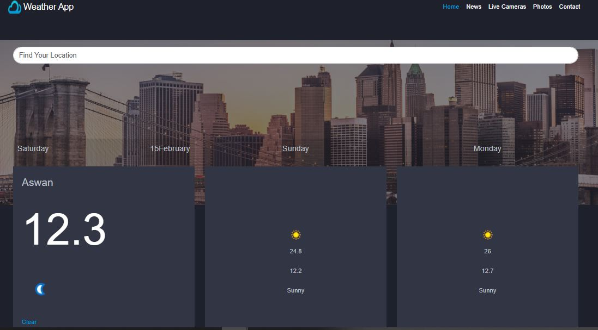

# 🌤️ Weather API Forecast App

## 🔍 Overview

This project is a web-based Weather Forecast App that displays current weather conditions and forecasts for the next two days for a selected location.  
It fetches data from a weather API and presents key details such as temperature, weather conditions, humidity, wind speed, and direction.  
The application is built using modern JavaScript (ES6), HTML5, CSS3, and Bootstrap to ensure a responsive and user-friendly interface.  
All weather data is retrieved via API calls, and the app supports real-time search functionality to update the forecast based on user input.

## ✨ Features

- **Current Weather:**  
  Displays current weather data including:
  - Location name
  - Temperature (°C)
  - Weather condition (icon and description)
  - Humidity, wind speed, and wind direction

- **Weather Forecast:**  
  Shows weather forecasts for the next two days with:
  - Day names (e.g., Friday, Saturday)
  - Maximum and minimum temperatures
  - Weather condition icons and descriptions

- **Search Functionality:**  
  Users can search for a city, and the app will fetch and display updated weather information in real time.

- **Real-Time Validation:**  
  Input fields for searching are validated on-the-fly using JavaScript and Bootstrap classes.

- **Responsive Design:**  
  The UI is built with Bootstrap, ensuring the app is fully responsive on devices of all sizes.

- **Icons & Visuals:**  
  The interface leverages Font Awesome icons to enhance user interaction and visual appeal.

## 🛠️ Technologies Used

- **HTML5 & CSS3:**  
  For building the structure and styling of the app.
- **JavaScript (ES6):**  
  For handling API calls, real-time search, and dynamic DOM manipulation.
- **Bootstrap :**  
  For creating a responsive layout and utilizing prebuilt UI components.
- **Font Awesome:**  
  For incorporating icons to improve the app’s visual design.
- **Weather API:**  
  To fetch current weather conditions and forecasts.

